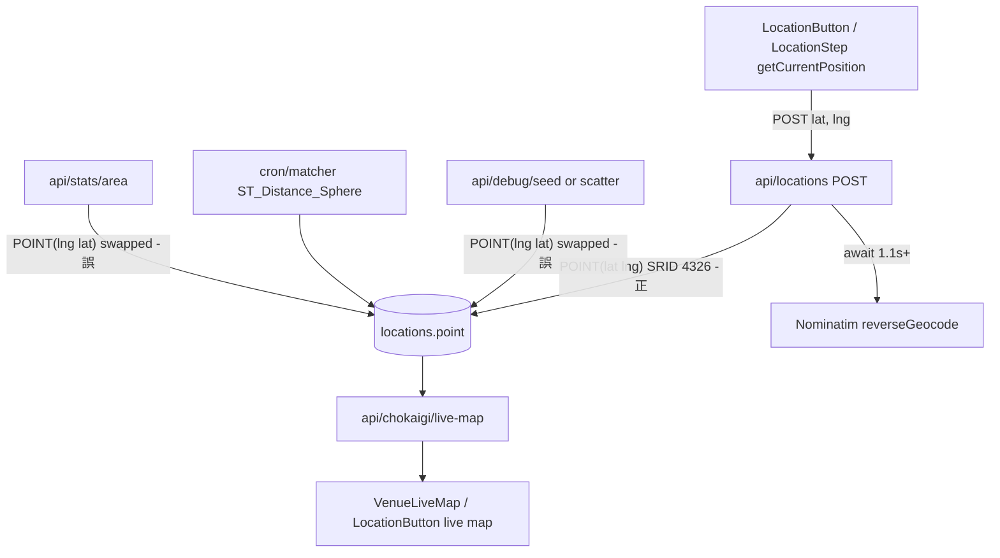

# 位置情報 不具合 調査レポート

作成日: 2026-04-22
対象リポジトリ: `surechigai-lite-handoff/server`
調査者: 開発アシスタント（静的コードレビュー）

本レポートは、位置情報まわり（送信 API / ライブマップ / マッチング cron / オンボーディング / デバッグ用エンドポイント）の実装を静的に読み込み、**現時点で確認できる不具合・リスク・改善余地**を一覧化したものです。実装上の修正は本レポートには含みません。修正は優先順位付けのうえ、別計画で実施してください。

> **関連**: バグ発見率そのものを上げるための取り組みは [`qa-improvement-plan.md`](./qa-improvement-plan.md) にまとめています。本レポートで列挙した不具合は、そちらの「既知の回帰テスト対象」に転記して回帰防止の対象になります。

---

## 1. スコープと前提

### 1.1 調査対象ファイル

- `src/app/api/locations/route.ts` （本番の位置送信 API）
- `src/app/api/chokaigi/live-map/route.ts` （会場ライブマップ取得 API）
- `src/app/api/stats/area/route.ts` （50km 圏アクティブ数）
- `src/cron/matcher.ts` （すれちがいマッチングバッチ）
- `src/app/app/components/LocationButton.tsx` （ダッシュボード送信 UI）
- `src/app/chokaigi/VenueLiveMap.tsx` （chokaigi 側ライブマップ UI）
- `src/app/onboarding/steps/LocationStep.tsx` （オンボーディングの位置情報ステップ）
- `src/lib/liveMapShared.ts` （共通投影/ポーリング設定）
- `src/lib/geocoding.ts` （Nominatim 逆ジオコーディング）
- `src/app/api/debug/seed/route.ts` / `src/app/api/debug/scatter/route.ts` （デバッグデータ投入）
- `scripts/init-db.sql` （`locations` / `encounters` スキーマ）

### 1.2 前提

- MySQL 8.0 以降を使用。`locations.point` は `GEOMETRY NOT NULL SRID 4326`。
- SRID 4326 (WGS84) の MySQL 8 における軸順序は **(緯度, 経度) = (lat, lng)**。WKT もこの順。
- ダッシュボード（`/app`）は UUID Bearer 認証、chokaigi LP（`/chokaigi`）は非ログインでも公開モード閲覧可。
- 本番/staging（Vercel 等サーバーレス想定）とローカル（長寿命 Node サーバー）で、モジュールグローバル状態の挙動が異なる点に留意。

### 1.3 症状として想定される事象

- すれちがいが成立しない / しにくい
- 自分の位置がライブマップに出ない
- 「送信しました」と出るが地図に反映されない
- 超会議会場で 50km 圏統計が 0 を返す
- iOS/Android の屋内で位置取得が TIMEOUT する

これらを本レポートの各所見に対応付けます。

---

## 2. 重大度 High（B 系）

### B-1. 緯度/経度の軸順序がエンドポイント間で食い違う【最重要】

**本番の書き込み（正しい順：`POINT(lat lng)`）**

```80:86:surechigai-lite-handoff/server/src/app/api/locations/route.ts
    // WKT: MySQL 8.0 + SRID 4326 は軸順序が POINT(緯度 経度) = POINT(lat lng)
    const pointWkt = `POINT(${Number(lat)} ${Number(lng)})`;
    await pool.execute(
      `INSERT INTO locations (user_id, point, lat_grid, lng_grid, municipality)
       VALUES (?, ST_GeomFromText(?, 4326), ?, ?, ?)`,
      [authResult.id, pointWkt, latGrid, lngGrid, municipality]
    );
```

**debug/seed は逆順で投入（`POINT(lng lat)` になっている）**

```80:84:surechigai-lite-handoff/server/src/app/api/debug/seed/route.ts
    await pool.execute(
      `INSERT INTO locations (user_id, point, lat_grid, lng_grid, created_at)
       VALUES (?, ST_SRID(POINT(?, ?), 4326), ?, ?, ?)`,
      [authResult.id, myLoc.lng, myLoc.lat, latGrid, lngGrid, now]
    );
```

```94:98:surechigai-lite-handoff/server/src/app/api/debug/seed/route.ts
      await pool.execute(
        `INSERT INTO locations (user_id, point, lat_grid, lng_grid, created_at)
         VALUES (?, ST_SRID(POINT(?, ?), 4326), ?, ?, ?)`,
        [createdUsers[i], loc.lng, loc.lat, locLatGrid, locLngGrid, locTime]
      );
```

**debug/scatter も同じく逆順**

```115:119:surechigai-lite-handoff/server/src/app/api/debug/scatter/route.ts
      await pool.execute(
        `INSERT INTO locations (user_id, point, lat_grid, lng_grid, municipality, created_at)
         VALUES (?, ST_SRID(POINT(?, ?), 4326), ?, ?, ?, ?)`,
        [userId, lng, lat, latGrid, lngGrid, muni, locTime]
      );
```

**stats/area も逆順で比較**

```21:29:surechigai-lite-handoff/server/src/app/api/stats/area/route.ts
    const [rows] = await pool.execute<RowDataPacket[]>(
      `SELECT COUNT(DISTINCT l.user_id) AS active_count
       FROM locations l
       JOIN users u ON u.id = l.user_id AND u.is_deleted = FALSE
       WHERE l.created_at >= DATE_SUB(NOW(), INTERVAL 24 HOUR)
         AND ST_Distance_Sphere(l.point, ST_SRID(POINT(?, ?), 4326)) <= 50000
         AND l.user_id != ?`,
      [lng, lat, authResult.id]
    );
```

**何が起きるか**

- 日本国内なら lat≈35、lng≈140。debug/seed / scatter では `POINT(140, 35)` として保存されるため、SRID 4326 の軸順序 (lat, lng) で解釈すると「lat=140（範囲外）, lng=35」となる。
- `ST_Distance_Sphere` に無効な緯度を渡した場合の挙動は MySQL バージョン依存で、エラーになるか、または極端に大きな距離値（数千 km / NaN 相当）が返る。
- 本番ユーザーの「正しい」ポイントと、debug で投入した「裏返った」ポイントが同じテーブルに混在している場合、**matcher が検出するペアの距離が破綻**し、すれちがいが「見つからない」または「遠すぎる判定」になる。
- `/api/stats/area` は全ユーザーに対して逆順でクエリしているため、**アクティブ数が常に異常**（0 または偶然一致しない限りヒットしない）。

**是正方針（参考、実装は別計画）**

- 全ての書き込み・比較を `POINT(lat lng)` で統一する。
- `ST_SRID(POINT(x, y), 4326)` 方式を使う場合も引数順は `(lat, lng)` に。
- debug データと本番データの混在を避けるため、debug 系投入済みデータは削除または再生成する運用手順を決める。

**影響度**: High / 本番データの正しさに直結

---

### B-2. `reverseGeocodeToMunicipality` のスロットルがサーバーレス/並列で事実上機能しない

```7:16:surechigai-lite-handoff/server/src/lib/geocoding.ts
let lastRequestTime = 0;

async function throttle() {
  const now = Date.now();
  const diff = now - lastRequestTime;
  if (diff < 1100) {
    await new Promise((resolve) => setTimeout(resolve, 1100 - diff));
  }
  lastRequestTime = Date.now();
}
```

**問題点**

- `lastRequestTime` はモジュールスコープ変数。Vercel Functions などのサーバーレス環境ではインスタンスごとに独立し、プロセス間で共有されない → 実質スロットルなし。
- 同一プロセス内でも、複数リクエストがほぼ同時に `throttle()` を呼び出すと「全員ほぼ同じ diff を見て 1.1 秒待ち、その後同時に発火」するため、直列化の意図どおりに動かない。
- `/api/locations` POST 経路でこれを同期的に待つ（下記）:

```71:78:surechigai-lite-handoff/server/src/app/api/locations/route.ts
    // 市区町村を逆ジオコーディングで取得(失敗してもエラーにはしない)
    const rawMunicipality = await reverseGeocodeToMunicipality(lat, lng).catch(
      () => null
    );
    const municipality =
      rawMunicipality != null && String(rawMunicipality).trim() !== ""
        ? String(rawMunicipality).trim().slice(0, MUNICIPALITY_MAX)
        : null;
```

- Nominatim は公開 API で **1 req/sec 以上は TOS 違反**、違反が続くと IP ブロック。
- 超会議当日のピーク時、数百人が同時に「現在地を送信」 → Nominatim に一気にリクエストが飛ぶ → ブロックや HTTP 429 → municipality が恒常的に null になる（B-6 = M-6 のゴーストマッチ不発の温床）。
- かつ、クライアントから見ると 1〜数秒のレスポンス遅延が発生。

**是正方針**

- a) POST レスポンスからジオコーディングを切り離し、書き込み直後に `waitUntil` / バックグラウンドで実施。
- b) 自前プロキシ or キャッシュ（市区町村は `lat_grid, lng_grid` 単位でキャッシュ可）。
- c) matcher cron などバックエンドのまとめ処理に寄せる（既に `reverseGeocodeWithPrefecture` は matcher 内で使われている）。

**影響度**: High / 当日の体感レイテンシ & サードパーティ API 停止リスク

---

### B-3. `/api/locations` の lat/lng バリデーションが NaN を素通しする

```36:49:surechigai-lite-handoff/server/src/app/api/locations/route.ts
    const { lat, lng } = body as { lat?: unknown; lng?: unknown };

    if (typeof lat !== "number" || typeof lng !== "number") {
      return Response.json(
        { error: "lat, lng は数値で指定してください" },
        { status: 400 }
      );
    }
    if (lat < -90 || lat > 90 || lng < -180 || lng > 180) {
      return Response.json(
        { error: "緯度経度の範囲が不正です" },
        { status: 400 }
      );
    }
```

- `typeof NaN === "number"` は `true`。`NaN` は範囲比較がすべて `false` になる。
- よって `{ "lat": NaN, "lng": NaN }` が到達すると `ST_GeomFromText("POINT(NaN NaN)", 4326)` が実行され、MySQL 側でエラーまたは不定動作。
- `Infinity / -Infinity` も同様。

**是正方針**

- `Number.isFinite(lat) && Number.isFinite(lng)` を追加で要求する（ワンライン）。

**影響度**: High（入力起因の 500 を誘発しうる） / 実装コスト Low

---

## 3. 重大度 Medium（M 系）

### M-1. 一時停止 `paused: true` 応答が UI に反映されない（「送信したのに地図に出ない」現象）

- サーバー側は一時停止中に位置情報を保存せず、こう返す:

```56:67:surechigai-lite-handoff/server/src/app/api/locations/route.ts
    if (userRows.length > 0 && userRows[0].location_paused_until) {
      const pausedUntil = new Date(userRows[0].location_paused_until);
      if (pausedUntil > new Date()) {
        console.log(`[位置送信] user_id=${authResult.id}: 一時停止中 (until: ${pausedUntil.toISOString()})`);
        return Response.json({ ok: true, paused: true });
      }
      // 一時停止期間が過ぎたらクリア
      await pool.execute(
        "UPDATE users SET location_paused_until = NULL WHERE id = ?",
        [authResult.id]
      );
    }
```

- クライアントは `res.ok` のみを見て成功扱い。`paused` フィールドは未参照:

```192:201:surechigai-lite-handoff/server/src/app/app/components/LocationButton.tsx
      if (!res.ok) {
        const errorMsg = await readFetchErrorMessage(res, "位置情報の送信に失敗しました");
        console.error(`[位置送信エラー] ステータス: ${res.status}, メッセージ: ${errorMsg}`);
        throw new Error(`HTTP ${res.status}: ${errorMsg}`);
      }

      console.log(`[位置送信成功] 座標: (${position.latitude}, ${position.longitude})`);
      setMessage({ type: "success", text: "位置情報を送信しました（500mグリッドで共有）" });
      setAiReport(null);
      await fetchLiveMap();
```

- ユーザーから見ると「送信成功 → 地図にいない」となり、不具合に見える。

**是正方針**: `paused === true` のとき「現在一時停止中です。マイページの位置共有設定を確認してください」等の情報メッセージに切り替える。

**影響度**: Medium（体験上の致命度は中だが直しやすい）

---

### M-2. `getCurrentPosition` 単発で位置が即座に陳腐化する

```167:177:surechigai-lite-handoff/server/src/app/app/components/LocationButton.tsx
      const position = await new Promise<GeolocationCoordinates>((resolve, reject) => {
        navigator.geolocation.getCurrentPosition(
          (pos) => resolve(pos.coords),
          reject,
          {
            enableHighAccuracy: true,
            maximumAge: 0,
            timeout: 25_000,
          }
        );
      });
```

```26:34:surechigai-lite-handoff/server/src/app/onboarding/steps/LocationStep.tsx
      const position = await new Promise<GeolocationPosition>(
        (resolve, reject) => {
          navigator.geolocation.getCurrentPosition(resolve, reject, {
            timeout: 10000,
            maximumAge: 0,
          });
        }
      );
```

- ユーザーが歩き回っても自動追従なし。live-map は 15 秒ごとに GET しているが、送信は手動ボタンのみ → 5 分後には古い位置で表示され続ける。matcher の `locations.created_at >= NOW() - 15 MIN` を満たさなくなり、すれちがい対象から外れる。
- 「ライブマップ」を名乗る体験と実装が乖離。

**是正方針**

- a) `navigator.geolocation.watchPosition` で継続取得、2〜5 分に 1 回の間引きで POST。
- b) Page Visibility API で裏に回ったら停止、戻ったら即再送。
- c) バッテリー配慮で `enableHighAccuracy` は初回のみ true、以降 false も検討。

**影響度**: Medium（超会議体験の肝）

---

### M-3. `LIVE_MAP_POLL_MS = 15000` を常時ポーリング（タブ非表示時も走る）

```37:37:surechigai-lite-handoff/server/src/lib/liveMapShared.ts
export const LIVE_MAP_POLL_MS = 15_000;
```

```247:253:surechigai-lite-handoff/server/src/app/app/components/LocationButton.tsx
  useEffect(() => {
    fetchLiveMap();
    const timer = setInterval(() => {
      fetchLiveMap();
    }, LIVE_MAP_POLL_MS);
    return () => clearInterval(timer);
  }, [fetchLiveMap]);
```

- ダッシュボード + chokaigi 双方の `useEffect` が同パターン。背面タブでも 15 秒おきに fetch → モバイル電池消費、帯域消費、DB 負荷（`live-map` は `dynamic = "force-dynamic"` で都度 DB 実行）。

**是正方針**

- `document.visibilityState === "visible"` のときのみインターバルを張る、`visibilitychange` で再開/停止。
- サーバー側で `Cache-Control: public, s-maxage=5, stale-while-revalidate=30` 等を検討（認証ヘッダー有無で分岐が必要）。

**影響度**: Medium（負荷・電池）

---

### M-4. 500m グリッド丸めが `Math.floor` による境界問題

```13:20:surechigai-lite-handoff/server/src/app/api/locations/route.ts
function toGrid(lat: number, lng: number) {
  const LAT_GRID = 0.0045; // 約500m（緯度方向）
  const LNG_GRID = 0.0055; // 約500m（経度方向 / 日本の緯度35度付近）
  return {
    latGrid: Math.floor(lat / LAT_GRID) * LAT_GRID,
    lngGrid: Math.floor(lng / LNG_GRID) * LNG_GRID,
  };
}
```

同様の処理が `debug/seed` L78-79, L90-91 / `debug/scatter` L110-111 に重複。

- `Math.floor` によるバケット化は、数 m の差で隣のバケットに落ちる境界問題を生む。
- matcher は `locations.point` を直接用いるので距離計算は影響を受けないが、**live-map の表示**は `lat_grid, lng_grid` を使ってピンを打っている:

```54:62:surechigai-lite-handoff/server/src/app/api/chokaigi/live-map/route.ts
  const [rows] = await pool.execute<LiveMapRow[]>(
    `SELECT
       l.user_id,
       u.nickname,
       u.twitter_handle,
       l.lat_grid,
       l.lng_grid,
```

- 結果、同じ交差点にいるユーザーが別セルに分散表示される。

**是正方針**: 表示用の投影には `point` から取得した生 lat/lng を使う（プライバシー配慮とトレードオフ。500m グリッド自体は公開上限として残す）。丸めるなら `Math.round` ベースが境界問題を半減。

**影響度**: Medium

---

### M-5. matcher の時間窓が非対称で検出漏れが発生しうる

```95:97:surechigai-lite-handoff/server/src/cron/matcher.ts
          WHERE a.created_at >= DATE_SUB(NOW(), INTERVAL 15 MINUTE)
            AND b.created_at >= DATE_SUB(NOW(), INTERVAL ${TIME_WINDOW_MINUTES + 15} MINUTE)
          AND NOT EXISTS (
```

- `a` は直近 15 分、`b` は直近 45 分（= `TIME_WINDOW_MINUTES(30) + 15`）。
- 結合は `a.user_id < b.user_id` のみで、時刻の新旧は暗黙。
- ある 2 ユーザー X, Y のうち「user_id が小さい方」が最近送っていない場合、X が `a`, Y が `b` のペアで拾えず検出漏れする。`a.created_at` の絞り込みを片側にしか掛けていないため。

**是正方針**

- 両辺とも 45 分で絞り、`ABS(TIMESTAMPDIFF(MINUTE, a.created_at, b.created_at)) <= TIME_WINDOW_MINUTES` を維持。
- または「直近 15 分に送信したユーザー集合 U」を事前計算し、`a.user_id IN U OR b.user_id IN U` にする。

**影響度**: Medium（検出率低下）

---

### M-6. Tier5（分身/ゴースト）マッチが `municipality` 厳密一致依存

```209:227:surechigai-lite-handoff/server/src/cron/matcher.ts
      // 同じ市区町村にいる実ユーザー(15分以内の位置情報)を探す
      const [nearbyUsers] = await conn.execute<mysql.RowDataPacket[]>(`
        SELECT DISTINCT l.user_id
        FROM locations l
        WHERE l.created_at >= DATE_SUB(NOW(), INTERVAL 15 MINUTE)
          AND l.user_id != ?
          AND l.municipality = ?
          AND NOT EXISTS (
```

- `locations.municipality` は Nominatim から逆ジオコーディングで得るが、B-2 の状況下で `NULL` になりがち。
- NULL のユーザーはゴーストマッチから永続的に除外される。
- 「おさんぽ機能が発動しない」という報告の潜在原因。

**是正方針**

- municipality が NULL のとき、分身座標（`ghost_lat, ghost_lng`）が設定済みなので、`ST_Distance_Sphere` での圏内判定にフォールバック。
- cron で NULL municipality を後埋めする小ジョブを追加。

**影響度**: Medium

---

## 4. 重大度 Low（L 系 / UX）

### L-1. `GeolocationPositionError` の `instanceof` は一部ブラウザで機能しない

```56:68:surechigai-lite-handoff/server/src/app/onboarding/steps/LocationStep.tsx
    } catch (error) {
      console.error("Location error:", error);
      let message = "位置情報の取得に失敗しました";

      if (error instanceof GeolocationPositionError) {
        if (error.code === error.PERMISSION_DENIED) {
          message = "位置情報の権限がありません";
        } else if (error.code === error.POSITION_UNAVAILABLE) {
          message = "位置情報が利用できません";
        } else if (error.code === error.TIMEOUT) {
          message = "位置情報の取得がタイムアウトしました";
        }
      }
```

- ブラウザによっては `GeolocationPositionError` のグローバルが存在しない、またはコールバックが渡す error オブジェクトがプロトタイプチェーンに載らず `instanceof` が常に false。
- LocationButton 側では `error.code` 値で分岐しており正しい:

```21:35:surechigai-lite-handoff/server/src/app/app/components/LocationButton.tsx
function messageForGeolocationFailure(error: unknown): string {
  const e = error as { code?: number; message?: string };
  const code = typeof e?.code === "number" ? e.code : undefined;
  // 1 PERMISSION_DENIED / 2 POSITION_UNAVAILABLE / 3 TIMEOUT
  if (code === 1) {
    return "位置情報がオフです。アドレスバー左の鍵アイコン → サイトの設定で「位置」を許可するか、OSの設定でブラウザの位置を許可してください。";
  }
  if (code === 2) {
    return "端末が位置を返せませんでした。GPSをオンにし、屋内は窓際・屋外を試すか、PCの場合はWi‑Fi位置推定が有効か確認してください。";
  }
  if (code === 3) {
    return "位置取得が時間切れです。通信を確認し、もう一度「現在地を送信」を押してください。";
  }
  return "位置情報の取得に失敗しました。HTTPSで開いているか、別ブラウザでも試してください。";
}
```

**是正方針**: onboarding 側も `error.code === 1/2/3` で分岐、もしくは `messageForGeolocationFailure` を共通化。

---

### L-2. onboarding は `timeout: 10000` かつ `enableHighAccuracy` 未指定

- 屋内での TIMEOUT 頻発。ダッシュボード（25 秒 + highAccuracy）と挙動が不整合。
- 「位置情報を許可 → 数秒後にエラー → スキップ」の離脱を生みやすい。

**是正方針**: `enableHighAccuracy: true`, `timeout: 25_000` に揃える。

---

### L-3. エラー文言の具体性がダッシュボードより薄い

- onboarding: 「位置情報が利用できません」
- dashboard: 「GPS をオンにし、屋内は窓際・屋外を試すか…」
- 共通化して一貫した案内にすべき。

---

### L-4. `VenueLiveMap` は `credentials: "include"` が無い

```31:33:surechigai-lite-handoff/server/src/app/chokaigi/VenueLiveMap.tsx
      const res = await fetch("/api/chokaigi/live-map", {
        headers,
      });
```

- Authorization ヘッダーを送るので現状は致命的ではないが、Clerk の Cookie セッションを参照する将来変更で壊れる可能性。整合のため `credentials: "include"` を足しておく。

---

### L-5. `LocationButton` のメッセージ自動消失 `setTimeout` が unmount 時に clear されない

```241:244:surechigai-lite-handoff/server/src/app/app/components/LocationButton.tsx
    } finally {
      setIsSending(false);
      setTimeout(() => setMessage(null), messageDismissMs);
    }
```

- unmount 後にも `setMessage` が呼ばれ、React が「アンマウント済みコンポーネント」警告を出しうる。小さな副作用だが、`useRef` で ID を保持しクリーンアップすべき。

---

### L-6. `lat_grid`/`lng_grid` が `DECIMAL(10,6)` だが実値は小数 3 桁で十分

```67:68:surechigai-lite-handoff/server/scripts/init-db.sql
  lat_grid DECIMAL(10,6) NOT NULL COMMENT '500mグリッド丸め緯度',
  lng_grid DECIMAL(10,6) NOT NULL COMMENT '500mグリッド丸め経度',
```

- `0.0045` / `0.0055` ステップなので有効桁は 3〜4 桁。DECIMAL(10,6) はやや過剰。インデックスも含め微小な肥大。優先度低。

---

### L-7. 公開モードで 500m グリッドの位置が匿名表示される（プライバシー観点）

```84:99:surechigai-lite-handoff/server/src/app/api/chokaigi/live-map/route.ts
    const users = rows.map((row, index) => {
      const rowUserId = Number(row.user_id);
      const isMe = Boolean(authUser && rowUserId === authUser.id);

      if (!authUser) {
        return {
          id: index + 1,
          nickname: `参加者${index + 1}`,
          twitterHandle: null,
          lat: Number(row.lat_grid),
          lng: Number(row.lng_grid),
          municipality: null,
          updatedAtMs: Number(row.created_at_ms),
          isMe: false,
        };
      }
```

- 匿名化しているが、500m グリッドの位置はそのまま公開。会場内だけなら許容範囲でも、**会場外の誰かがダッシュボードから送っていた場合**、第三者が地理情報を観察できる。
- 会場周辺（幕張メッセ近傍 5km）に限定されているので現状は軽微。B-1 修正後に仕様として再確認したい。

---

### L-8. `/api/chokaigi/live-map` の `publicMode` メッセージが UI に一部未反映

- API は `note` を切り替えているが、`VenueLiveMap.tsx` では `payload?.publicMode` で文言バナーを出している一方、LocationButton 側（ダッシュボード）は public 状態になり得ないためスキップしている。整合性の観点で問題なし。記録のみ。

---

## 5. 副次的リスク

- **個人位置のログ出力**: `/api/locations` POST で生 lat/lng を `console.log` に出力している（L59, L88）。運用ログに正確位置が残るのはプライバシー的に望ましくない。grid のみに絞るべき。
  ```88:88:surechigai-lite-handoff/server/src/app/api/locations/route.ts
      console.log(`[位置送信成功] user_id=${authResult.id}, lat=${lat}, lng=${lng}, grid=(${latGrid},${lngGrid}), municipality=${municipality}`);
  ```
- **matcher SQL のテンプレート補間**: `${radius}`, `${TIME_WINDOW_MINUTES}` が SQL に直接埋まっている。現状は定数なので安全だが、将来動的値が入った瞬間に SQL インジェクション化する。プレースホルダに移す方針が安全。
- **live-map の `dynamic = "force-dynamic"` + 15 秒ポーリング**: ユーザー数 × 2 画面でクエリ量が線形増加。`idx_grid(lat_grid, lng_grid, created_at)` を活用できる EXPLAIN を取っておきたい。

---

## 6. 再現手順（共通）

### 6.1 軸順序バグの観測（B-1）

1. ローカル DB に `init-db.sql` を適用。
2. 認証済みで `/api/debug/seed` を叩く → `locations.point` に **(lng lat)** 順のデータが投入される。
3. 直後に `/api/stats/area?lat=35.68&lng=139.77` を叩く。
   - 期待: 東京駅 50km 圏のアクティブ数
   - 実際: 0 または異常値（アクティブデータがあっても距離計算が破綻する）
4. MySQL で `SELECT ST_AsText(point) FROM locations` を見ると `POINT(139.77 35.68)` になっている行と `POINT(35.68 139.77)` になっている行が混在しているのを確認。

### 6.2 バリデーション漏れ（B-3）

1. 認証済みで `POST /api/locations` に `{ "lat": null, "lng": null }` ではなく、`{ "lat": 0/0, "lng": 0/0 }` 相当の `NaN` を JSON.stringify で送る（手動で `"NaN"` リテラルを送信）。
   - 注意: 標準 JSON では NaN は表現不可だが、fetch で `body: "{\"lat\":NaN,\"lng\":NaN}"` のようにすると生パースで通る経路がありうる。確実な再現としては `lat: 1e400`（`Infinity`）を使う。
2. バリデーションを通過し、MySQL 側で不正値として失敗する、または通ってしまう挙動を観察。

### 6.3 一時停止応答の誤誘導（M-1）

1. 自分の `users.location_paused_until` を未来時刻に設定。
2. ダッシュボードで「現在地を送信」を押す。
3. 「位置情報を送信しました」表示 → ライブマップには出ない（= 実は保存されていない）。

### 6.4 matcher 非対称時間窓（M-5）

1. 小さい user_id 側（例 user1）は 30 分前に最後の送信、大きい user_id 側（user2）は 5 分前に送信したシナリオをデバッグ投入。
2. matcher を実行 → `a.created_at >= 15 分` に user1 が入らず検出漏れ。

---

## 7. 修正の優先順位（推奨）

| 順 | 項目 | 理由 |
| --- | --- | --- |
| 1 | **B-1 軸順序統一** | 本番データ・統計・マッチング精度に直結。debug データ汚染分のクレンジング計画も必要。 |
| 2 | **B-3 NaN/Infinity バリデーション** | 1 行で潰せる。本番 5xx の芽を潰す。 |
| 3 | **B-2 逆ジオコーディング非同期化** | 超会議ピーク前に必須。Nominatim 停止で即影響。 |
| 4 | **M-1 paused 応答の UI 分岐** | 体験誤誘導。短工数。 |
| 5 | **M-5 matcher 時間窓の対称化** | 検出漏れに直結。 |
| 6 | **M-6 municipality NULL フォールバック** | ゴーストマッチ発動率改善。 |
| 7 | **M-2 watchPosition / 自動追従**、**M-3 visibility対応** | 追従性と電池のバランス。 |
| 8 | L-1 〜 L-8 | 個別にまとめて PR 可能。 |

---

## 8. 補足: 軸順序のフロー図



---

## 9. このレポートの範囲外（後続タスク候補）

- 本レポートに基づく修正 PR（B-1 / B-2 / B-3 を個別に）
- debug データのクレンジング SQL スクリプト（軸順序混在データの検出と削除）
- Nominatim リバースジオコーディングの内製プロキシ/キャッシュ実装
- `watchPosition` ベースの継続送信 UX プロトタイプ
- live-map のキャッシュ戦略（Cache-Control / KV 等）
- プライバシーレビュー（匿名公開モードの仕様見直し）

以上。
