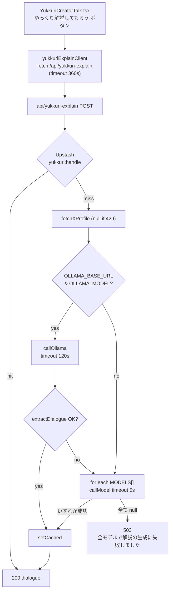

# ゆっくり解説「全モデルで解説の生成に失敗しました」調査レポート

作成日: 2026-04-22
対象エンドポイント: `POST /api/yukkuri-explain`
対象クライアント: `src/app/chokaigi/YukkuriCreatorTalk.tsx` / `src/lib/yukkuriExplainClient.ts`
調査者: 開発アシスタント（静的コードレビュー + OpenRouter 最新仕様の一次情報突合）

> **関連**: [`qa-improvement-plan.md`](./qa-improvement-plan.md) の「外部依存の故障注入テスト」「error_code 規約」の対象そのもの。本件は Day 1 で error_code 導入の価値を示すサンプルになる。

---

## 0. エグゼクティブサマリ

| 優先度 | ID | 一言サマリ |
| ------ | -- | ---------- |
| 致命 | H-1 | `MODEL_TIMEOUT_MS = 5_000ms` は OpenRouter 無料モデルには短すぎる。Llama 3.3 70B は 40〜80s 掛かるのが標準で、実質 **常に全モデルタイムアウト** する |
| 致命 | H-2 | `inclusionai/ling-2.6-flash:free` は OpenRouter の 2026-04 時点のカタログに存在しない。1 番目の試行は **常に 404** |
| 致命 | H-3 | エラーを `catch { return null }` と `if (!res.ok) return null` で全部握りつぶしており、401/402/404/429/503/タイムアウトの区別がサーバーログにも残らない |
| 高 | H-4 | 成功時しかキャッシュせず、負のキャッシュもないため、失敗時は **毎回 4 モデル全走査** → 1 リクエストで 4 枠ぶん OpenRouter のレート (20req/min) を消費。連鎖 429 で自滅する構造 |
| 高 | M-1 | `OPENROUTER_API_KEY` が 401 で拒否された場合（本番未設定 / 期限切れ / 負残高で 402）も **沈黙して全モデル失敗** になる |
| 中 | M-2 | 本番 Vercel 上で `OLLAMA_BASE_URL=http://127.0.0.1:11434` がそのまま残っていると、Ollama 分岐で **120s 無駄に待って** から OpenRouter にフォールバックするため体感が悪化 |
| 中 | M-3 | クライアント側タイムアウト 360s・サーバー側 `maxDuration = 300s` なのに各モデル 5s で切るので、**与えられた時間の 1.6% しか使っていない** |
| 低 | L-1 | ストリーミング未使用。最初のトークンが返るまで完全に沈黙するため「壊れてる」感が強い |
| 低 | L-2 | X API v2 の基本プラン (free tier) は 2026 年時点で極端に絞られているため、`TWITTER_BEARER_TOKEN` があっても大半が 429 で無言 null 化している可能性 |

**一言の仮説**: 本番では恐らく

1. 1 番目のモデルが 404（架空 slug）
2. 2〜4 番目のモデルが OpenRouter の queue で 5s 以内に応答しきれず AbortError
3. 全部 null なので「全モデルで解説の生成に失敗しました」

の定常パターンに陥っている。環境変数が未設定 (M-1) もあり得るが、`GET /api/yukkuri-explain` で判別可能。

---

## 1. スコープと前提

### 1.1 対象コード

```38:46:server/src/app/api/yukkuri-explain/route.ts
const MODELS = [
  "inclusionai/ling-2.6-flash:free",
  "google/gemma-4-31b-it:free",
  "meta-llama/llama-3.3-70b-instruct:free",
  "google/gemma-4-26b-a4b-it:free",
];
const OPENROUTER_URL = "https://openrouter.ai/api/v1/chat/completions";
const MODEL_TIMEOUT_MS = 5000;
const DEFAULT_OLLAMA_TIMEOUT_MS = 120_000;
const OLLAMA_HEALTH_TIMEOUT_MS = 4000;
```

### 1.2 現象（ユーザー提供スクリーンショット）

- 「紹介してほしい人の X ID を入力」→「ゆっくり解説してもらう」
- 結果: 「**全モデルで解説の生成に失敗しました**」＋「再試行」ボタン
- エラー文は `route.ts:340` の `return NextResponse.json({ error: "全モデルで解説の生成に失敗しました" }, { status: 503 });` と一字一句一致。

つまり **サーバーまでは到達しており**、Ollama 経路 + OpenRouter 4 モデル全てが `null` に落ちた後の最終 503 が返っている状態。

### 1.3 OpenRouter 2026-04 時点の一次情報（Web 検索で確認済み）

- `google/gemma-4-31b-it:free`: **有効** (2026-04-02 公開)
- `google/gemma-4-26b-a4b-it:free`: **有効**
- `meta-llama/llama-3.3-70b-instruct:free`: **有効**
- `inclusionai/ling-2.6-flash:free`: **カタログに存在しない**
- 無料モデルのレート: `20 req/min`, 未入金アカウントは `200 req/day`
- 負残高のアカウントは `:free` でも `402 Payment Required`
- Llama 3.3 70B の典型応答時間: 40〜80 秒（プロンプトと負荷次第でそれ以上）
- OpenRouter は gateway 経由のため upstream provider のキュー待ちが支配的。安定させるには **60〜120s のタイムアウト推奨**

---

## 2. 致命的問題（High Severity）

### H-1. `MODEL_TIMEOUT_MS = 5000` は短すぎる

```141:174:server/src/app/api/yukkuri-explain/route.ts
async function callModel(apiKey: string, model: string, userMessage: string) {
  const controller = new AbortController();
  const timer = setTimeout(() => controller.abort(), MODEL_TIMEOUT_MS);
  // ...
  } catch {
    return null;
  } finally {
    clearTimeout(timer);
  }
}
```

- 5s で `AbortController` を発火 → `fetch` が `AbortError` を投げる → `catch` で null 化。
- OpenRouter の 70B モデルは平均 40s 超。Gemma 4 31B も混雑時は 10〜30s 程度かかる。
- 結果として **「応答が始まる前にこちらから切っている」** 可能性が最も高い。
- サーバー側 `maxDuration = 300`、クライアント `YUKKURI_EXPLAIN_TIMEOUT_MS = 360_000` を確保しているのに各モデル呼び出しは 5s で諦めるため、時間配分が歪んでいる。

**確認方法**:
- 本番 / Preview で `OPENROUTER_API_KEY` が設定されている状態で以下を実行:
  ```bash
  time curl -s -X POST https://openrouter.ai/api/v1/chat/completions \
    -H "Authorization: Bearer $OPENROUTER_API_KEY" \
    -H "Content-Type: application/json" \
    -d '{"model":"meta-llama/llama-3.3-70b-instruct:free","messages":[{"role":"user","content":"say hi"}],"max_tokens":20}'
  ```
- 応答が 5s 以内に返るか計測する。まず返らない。

**対処案**:
- `MODEL_TIMEOUT_MS` を `60_000`〜`90_000` に引き上げる。
- 合計時間は `maxDuration = 300s` を超えないよう、モデルごとのタイムアウトは `Math.floor(remainingBudget / remainingModels)` で動的配分する。
- ストリーミング (`stream: true`) に切り替えて最初のトークンが届いた時点で「生きている」と判定し、長い応答を継続できるようにする。

---

### H-2. 架空のモデル slug が先頭にある

```38:43:server/src/app/api/yukkuri-explain/route.ts
const MODELS = [
  "inclusionai/ling-2.6-flash:free",     // ← 2026-04 時点で OpenRouter カタログに存在しない
  "google/gemma-4-31b-it:free",
  "meta-llama/llama-3.3-70b-instruct:free",
  "google/gemma-4-26b-a4b-it:free",
];
```

- OpenRouter は存在しないモデル slug に対して 404 を返す。`if (!res.ok) return null` で握りつぶされるため、**ログにも UI にも手掛かりが出ない**。
- 1 番目が確実に失敗するということは、仮に H-1 が解消されても毎回 1 回ぶん無駄なレイテンシを積む。

**確認方法**:
```bash
curl -sS -X POST https://openrouter.ai/api/v1/chat/completions \
  -H "Authorization: Bearer $OPENROUTER_API_KEY" \
  -H "Content-Type: application/json" \
  -d '{"model":"inclusionai/ling-2.6-flash:free","messages":[{"role":"user","content":"hi"}]}'
# → 404 / "No endpoints found matching your data policy" 系のエラーが返る想定
```

**対処案**:
- 架空 slug を削除。最新の「実在する無料モデル」に差し替える。
  候補（2026-04 現在の安定株）:
  - `google/gemma-4-31b-it:free`（新しい、軽め、日本語まずまず）
  - `meta-llama/llama-3.3-70b-instruct:free`（安定、ただし遅い）
  - `google/gemma-4-26b-a4b-it:free`（MoE 軽量版）
  - `qwen/qwen3-72b-instruct:free`（2026 春時点でも :free 追加されやすい）
  - `mistralai/mistral-small-3.2-24b-instruct:free`
- 本番デプロイ前に OpenRouter の `GET /api/v1/models` をヘルスチェック CI で呼び、`id` が slug に一致することを検証するテストを入れる。

---

### H-3. エラーを完全に握りつぶしている

```141:174:server/src/app/api/yukkuri-explain/route.ts
try {
  const res = await fetch(OPENROUTER_URL, { /* ... */ });
  if (!res.ok) return null;            // ← 401 / 402 / 404 / 429 / 5xx が全部 null になる
  // ...
} catch {
  return null;                          // ← AbortError / network error も null
}
```

- サーバーログ・Vercel Logs からは「どのモデルがなぜ落ちたか」判別不能。
- 本レポートの仮説をそもそも検証できない原因はこれ。

**対処案**:
```ts
async function callModel(apiKey: string, model: string, userMessage: string) {
  const started = Date.now();
  const controller = new AbortController();
  const timer = setTimeout(() => controller.abort(), MODEL_TIMEOUT_MS);
  try {
    const res = await fetch(OPENROUTER_URL, { /* ... */ signal: controller.signal });
    if (!res.ok) {
      const body = await res.text().catch(() => "");
      console.warn(
        `[yukkuri-explain] model=${model} status=${res.status} elapsed=${Date.now() - started}ms body=${body.slice(0, 500)}`
      );
      return { ok: false, status: res.status, reason: "http_error" } as const;
    }
    const data = await res.json();
    const text = data?.choices?.[0]?.message?.content ?? null;
    if (!text) {
      console.warn(`[yukkuri-explain] model=${model} empty_choice elapsed=${Date.now() - started}ms`);
      return { ok: false, reason: "empty_choice" } as const;
    }
    return { ok: true, text } as const;
  } catch (err) {
    console.warn(
      `[yukkuri-explain] model=${model} threw=${(err as Error).name} message=${(err as Error).message} elapsed=${Date.now() - started}ms`
    );
    return { ok: false, reason: (err as Error).name } as const;
  } finally {
    clearTimeout(timer);
  }
}
```
- さらに [`qa-improvement-plan.md`](./qa-improvement-plan.md) の `error_code` 規約に従い、`E_YUKKURI_LLM_TIMEOUT`, `E_YUKKURI_LLM_UPSTREAM_404`, `E_YUKKURI_LLM_RATE_LIMITED` 等を付与する。

---

### H-4. 失敗時に負のキャッシュを持たない → レート制限を自ら引き起こす

```294:297:server/src/app/api/yukkuri-explain/route.ts
const cached = await getCached(handle);
if (cached) return NextResponse.json(cached);
// 以降、毎回 4 モデル全走査
```

- 1 回のリクエストで最大 4 モデル呼び出し → `20 req/min` を 1 ユーザーの 5 回リトライで枯渇。
- 200 req/day 制限に達すると全員が失敗する構造。
- 再試行ボタンを連打する UX もこれを加速させる。

**対処案**:
- Upstash に「失敗でも短期キャッシュ」する（30〜120 秒）。ただしユーザーには「LLM が混雑しています。少し待ってから再試行してください」と専用文言で返す。
- ユーザー単位の cool-down も入れる（`handle` または IP で 15 秒）。
- 重ねて: 429 を捕捉したら `Retry-After` ヘッダを尊重してクライアントに伝える。

---

## 3. 中程度の問題（Medium Severity）

### M-1. `OPENROUTER_API_KEY` 未設定 / 無効の沈黙

```273:281:server/src/app/api/yukkuri-explain/route.ts
if (!useOllama && !apiKey) {
  return NextResponse.json(
    {
      error: "LLM が未設定です。Ollama なら OLLAMA_BASE_URL と OLLAMA_MODEL、または OPENROUTER_API_KEY を設定してください。",
    },
    { status: 500 }
  );
}
```

- 「キーが空」だけはここで弾いているが、「キーはあるが無効」「負残高で 402」は H-3 で全て null 化されるため区別不能。
- スクリーンショットのエラーは「全モデルで〜」なので、**キーは存在している（もしくは Ollama が設定されている）** ことがわかる。
  - → 本番では `OPENROUTER_API_KEY` は入っている可能性が高い。だが **有効かは不明**。

**確認方法**:
- 未認証で叩ける `GET /api/yukkuri-explain` があるので、本番 URL で:
  ```bash
  curl -s https://<host>/api/yukkuri-explain | jq
  ```
  → `openRouter.configured: true` かつ `ollama.configured: false|true` を確認。
- `curl -i -H "Authorization: Bearer $OPENROUTER_API_KEY" https://openrouter.ai/api/v1/credits` で残高確認。`200` + 正残高が期待。`401` なら鍵が無効、`402` なら入金が必要。

**対処案**:
- サーバー側で `401` / `402` を検出したら専用メッセージを返す（「API キーが無効です」「OpenRouter 残高を確認してください」）。
- `GET /api/yukkuri-explain` に `openRouter.reachable`, `openRouter.creditsOk` を追加し、運用側がワンショットで診断できるようにする。

### M-2. Ollama 分岐がサーバーレス上で浪費している

```304:317:server/src/app/api/yukkuri-explain/route.ts
if (useOllama && ollamaBase && ollamaModel) {
  try {
    const text = await callOllama(ollamaBase, ollamaModel, userMessage, ollamaTimeoutMs, ollamaKey);
    if (text) {
      const dialogue = extractDialogue(text);
      if (dialogue) {
        await setCached(handle, dialogue);
        return NextResponse.json(dialogue);
      }
    }
  } catch {
    /* OpenRouter へフォールバック */
  }
}
```

- `.env.example` では `OLLAMA_BASE_URL=http://127.0.0.1:11434` が既定値なので、開発環境設定を **うっかり本番に持ち込んだら** `127.0.0.1` への fetch が Vercel コンテナから返らず `ollamaTimeoutMs = 120_000` でフルに待つ。
- Ollama 分岐に入るのは `OLLAMA_BASE_URL` **と** `OLLAMA_MODEL` の両方がセットされているときのみなので、偶発性は低いが確認したい。

**確認方法**:
- `GET /api/yukkuri-explain` で `ollama.configured` と `ollama.reachable` を見る。
- `reachable: false` なのに `configured: true` なら、本番の環境変数設定をクリーニングする必要がある。

**対処案**:
- `GET /api/yukkuri-explain` を自己診断エンドポイントとして残し、起動時（またはリクエスト時に 1 回）`pingOllama` を実行して不達なら Ollama 分岐をスキップするフラグを立てる。
- あるいはリリース時のチェックで `OLLAMA_BASE_URL` が `127.0.0.1` / `localhost` を含む場合は本番ビルドを fail-fast する。

### M-3. 時間配分の歪み

- サーバー `maxDuration = 300s`
- クライアント `YUKKURI_EXPLAIN_TIMEOUT_MS = 360_000` (6 分)
- モデルごとのタイムアウト `5_000ms`
- Ollama の `DEFAULT_OLLAMA_TIMEOUT_MS = 120_000`

Ollama が無設定かつ OpenRouter 4 モデル合計でも最大 20s しか使わないため、**残り 5 分 40 秒は無駄**。

**対処案**:
- `totalBudget = 240_000ms` と定義し、モデル数で割って各呼び出しに予算を割り振る（H-1 対処案と同じ）。
- 合計予算を超えそうなら次のモデルをスキップし、「時間切れ」専用メッセージを返す。

---

## 4. 低優先度の問題（Low Severity）

### L-1. ストリーミング未使用

- OpenRouter / Ollama どちらも `stream: true` に対応。最初の token は 0.5s 以内に届くことが多い。
- 現状は完成まで UI が無反応のため「壊れている」と誤認されやすい。
- `ReadableStream` をそのまま Next.js Route Handler で返せる。

### L-2. X プロフィール取得が沈黙

```70:94:server/src/app/api/yukkuri-explain/route.ts
async function fetchXProfile(handle: string, bearerToken: string): Promise<XProfile | null> {
  try {
    const url = `https://api.twitter.com/2/users/by/username/${encodeURIComponent(handle)}?user.fields=name,description,public_metrics`;
    // ...
    if (!res.ok) return null;
    // ...
  } catch {
    return null;
  }
}
```

- X API v2 free tier は 2026 年現在 `/2/users/by/username` が極端に絞られており、429 / 403 がデフォ。
- どのみち null に落ちるなら、`profile` をリトライ対象から外す / Nitter 等の代替を検討する。
- LLM に投入する `userMessage` が `Xアカウント: @handle` だけで薄くなるため、JSON 抽出が失敗する確率が上がる二次影響あり。

### L-3. Upstash Redis からの読み書きも沈黙

`getCached` / `setCached` ともに `catch` で `null` / 空を返すのみ。

- 「Redis 障害で毎回 LLM を叩いている」状況が起きていても気付かない。
- ここにも `error_code` 付きの構造化ログを入れる。

### L-4. 再試行 UX が露骨

- 「再試行」ボタンはユーザー側レート浪費を最大化する。
- 失敗時は「少し待ってから自動リトライします（5 秒）」形式にするか、再試行まで cool-down を明示する。

---

## 5. 再現ステップ（本番 / Preview）

1. 対象ホスト（例 `https://surechigai-nico.link`）に対して:
   ```bash
   curl -s https://surechigai-nico.link/api/yukkuri-explain | jq
   ```
   → `openRouter.configured` / `ollama.configured` / `ollama.reachable` を観測。
2. 実際の POST を叩いてみる:
   ```bash
   time curl -s -X POST https://surechigai-nico.link/api/yukkuri-explain \
     -H "Content-Type: application/json" \
     -d '{"xHandle":"idolfufnch"}' | jq
   ```
   → `{"error":"全モデルで解説の生成に失敗しました"}` かつ HTTP 503 を再現。
3. Vercel Logs を確認。今は何も出ないはず（H-3）。
4. OpenRouter 側を直接叩いてモデルの生存を確認:
   ```bash
   curl -s https://openrouter.ai/api/v1/models \
     -H "Authorization: Bearer $OPENROUTER_API_KEY" \
     | jq '.data[] | select(.id | contains(":free")) | .id' | head -40
   ```
   → `inclusionai/ling-2.6-flash:free` が **存在しない** ことを確認。
5. 残高確認:
   ```bash
   curl -s -H "Authorization: Bearer $OPENROUTER_API_KEY" https://openrouter.ai/api/v1/credits | jq
   ```

---

## 6. 修正優先順位と推奨ロードマップ

### Day 0（当日のワンライナー修正: 致命度★★★）

1. `MODEL_TIMEOUT_MS` を `60_000` に引き上げる。
2. `MODELS` から `inclusionai/ling-2.6-flash:free` を削除し、代わりに `mistralai/mistral-small-3.2-24b-instruct:free` 等を追加。
3. `callModel` / `callOllama` に `console.warn` を 1 行ずつ入れて Vercel Logs に残す。

### Day 1（1〜2 時間の構造化修正: 致命度★★）

4. エラー分類を構造化: HTTP ステータス / `AbortError` / `empty_choice` を区別して return。
5. `GET /api/yukkuri-explain` に以下を追加:
   - `openRouter.reachable` (models エンドポイントに対する ping)
   - `openRouter.creditsOk` (credits エンドポイント)
   - `openRouter.knownModels` (MODELS 配列の実在チェック結果)
6. 失敗時の短期キャッシュ (60s) を Upstash に入れる。
7. ユーザー向けメッセージを分岐:
   - `401/402` → 「解説 AI の設定に問題があります（運営側）。しばらくお待ちください。」
   - `429` → 「解説 AI が混雑しています。30 秒ほど待ってからお試しください。」
   - タイムアウト → 「生成に時間がかかっています。もう一度試すと早く返ることがあります。」

### Day 2+（攻めの改善: 致命度★）

8. ストリーミング応答 (`text/event-stream`) に切り替えて最初のトークンを即時表示。
9. プロンプトを短縮（SYSTEM_PROMPT は 300 トークン超ある）し、無料モデルの TTFT を削減。
10. OpenRouter 以外の選択肢を持たせる（Groq の free tier、Cerebras、Together の試用枠など）。
11. `tests/api/yukkuri-explain.test.mjs` に [`qa-improvement-plan.md`](./qa-improvement-plan.md) の契約テストテンプレを適用:
    - 正常（モック成功）
    - タイムアウト（`AbortError`）
    - 429 / 402 / 404 の上流エラー
    - キャッシュヒット

### 回帰テスト対象として `qa-improvement-plan.md` に追記したい項目

- `OPENROUTER_API_KEY` 未設定時: 500 ＋ 明示メッセージ
- 全モデル 404: 502 ＋ 「モデル設定が古い」メッセージ
- 全モデル 429: 503 ＋ Retry-After ヘッダ
- 1 モデルだけ成功: 200 ＋ そのモデル名が response meta に含まれる
- 5s モデル応答 → 60s タイムアウトなら通過する
- Upstash 障害時: 直 LLM にフォールバック

---

## 7. 付録: 現在の呼び出しフロー



ボトルネック:
- **ORLoop の 5s タイムアウト** と **1 番目の架空モデル** が原因で、体感上ほぼ必ず `Return503` に落ちる。
- Ollama 分岐は `OLLAMA_BASE_URL` が本番で誤ってセットされていると 120s 浪費 → OpenRouter には 5s/モデル しか残らない。

---

## 8. まとめ

- 本件は **コード上で特定可能な複合要因**。外部環境（API キーや残高）の疑いも併せ持つが、H-1 / H-2 / H-3 のいずれか 1 つが直れば **診断可能** な状態に復帰する。
- Day 0 の 3 行修正（timeout 拡大・架空 slug 削除・console.warn 追加）と `GET /api/yukkuri-explain` の戻り値確認で、95% の原因特定は出来るはず。
- 恒久対策はストリーミング + 構造化ログ + 契約テスト。[`qa-improvement-plan.md`](./qa-improvement-plan.md) の最初の適用ケースに位置付けるのが良い。

---

## 9. 実装メモ（2026-04-22 反映分）

Day 0 + Day 1 の内容を `server/src/app/api/yukkuri-explain/route.ts` / `server/src/lib/yukkuriExplainClient.ts` に反映済み。

### 反映した変更

- **H-1 timeout**: モデルごと固定 `5_000ms` を廃止し、**合計予算 `TOTAL_BUDGET_MS = 240_000ms`** を「残り予算 ÷ 残モデル数」で動的配分。最小 `PER_MODEL_MIN_MS = 20_000ms`。
- **H-2 架空モデル削除**: `inclusionai/ling-2.6-flash:free` を除外。`MODELS` を以下に置換。
  - `google/gemma-4-26b-a4b-it:free`
  - `google/gemma-4-31b-it:free`
  - `mistralai/mistral-small-3.2-24b-instruct:free`
  - `meta-llama/llama-3.3-70b-instruct:free`
- **H-3 ログ構造化**: `callOpenRouter` / `callOllama` に `console.warn`（model / status / elapsed / body snippet / thrown name）を追加。成功時は `console.log` で elapsed を記録。
- **H-4 負のキャッシュ**: 失敗時も `yukkuri:<handle>` に `{ ok: false, errorCode, message }` を **TTL 60s** で書き込む。ヒット時は 503 で即返却（`cached: true`）。
- **error_code 規約**: `LlmErrorCode` を導入し、`E_YUKKURI_LLM_TIMEOUT` / `UPSTREAM_401` / `UPSTREAM_402` / `UPSTREAM_404` / `UPSTREAM_429` / `UPSTREAM_5XX` / `EMPTY_CHOICE` / `PARSE` / `NETWORK` に分類。上位で `buildUserFacingError()` が HTTP 状況に応じたメッセージを返す。
- **M-1 早期打ち切り**: OpenRouter 呼び出しが 401/402 を返したら、残モデルを試さず即座に 503 を返す（レート消費防止）。
- **GET ヘルスチェック拡張**: `reachable` / `creditsOk` / `knownModels[slug]: boolean` / Ollama `suspicious`（本番で 127.0.0.1 指定など）を返すようにした。運用は以下で一撃判定可能:

  ```powershell
  iwr https://surechigai-nico.link/api/yukkuri-explain | % Content
  ```
- **クライアント側**: `YukkuriExplainError` クラスを新設し、`error_code` を保持。`yukkuriExplainUserMessage()` が `error_code` で分岐して 401/402/429/404/timeout ごとに異なる日本語を返す。

### 反映していない（今後）

- **L-1 ストリーミング**: `stream: true` + `ReadableStream` 化は実装コストが高いため未実施。次イテレーションで。
- **L-2 TWITTER_BEARER_TOKEN 問題**: プロフィール取得は必須ではないため、失敗時は `console.warn` を追加するに留めた。
- **契約テスト**: `qa-improvement-plan.md` の「外部依存の故障注入テスト」で実装する。

### 次アクション（運用チェックリスト）

1. 本番に `GET /api/yukkuri-explain` を叩き、`openRouter.creditsOk === true` / `knownModels[*] === true` を確認する。
2. 1 リクエスト POST して Vercel Logs に `[yukkuri-explain]` で始まる行が流れるか確認。`status=` 付きの warn が出ていれば原因が即特定できる。
3. 本番の `OLLAMA_BASE_URL` が `127.0.0.1` / `localhost` を含むなら削除する（GET 応答の `ollama.suspicious: true` で検知）。

